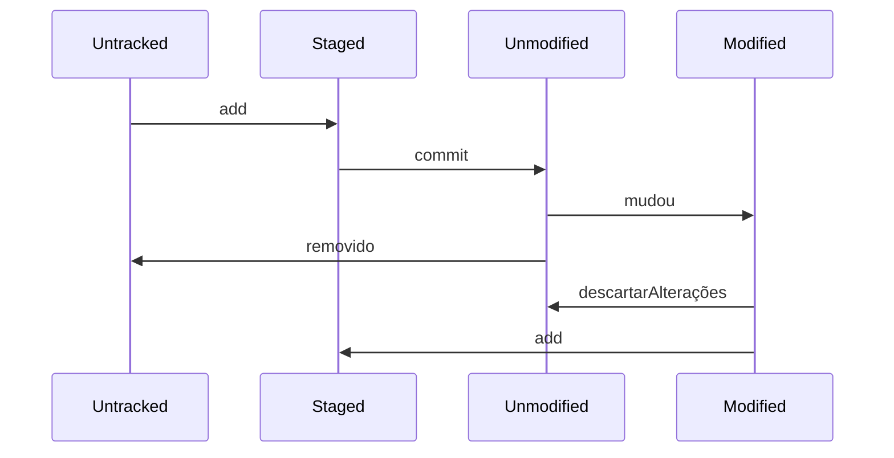

# Primeiro projetinho!

Vou colocar aqui algumas coisinhas que anotei.

### Por quê é útil?

Gerenciar versões dum projeto, tem histórico então pode voltar atrás e várias pessoas podem trabalhar em conjunto.

### Tipos de versionamento

**Centralizado** -  tudo num servidor só
**Distribuido** - toda máquina tem uma cópia

## Ciclo dos arquivos!!!!

# Por agora, é só:heart_eyes:

